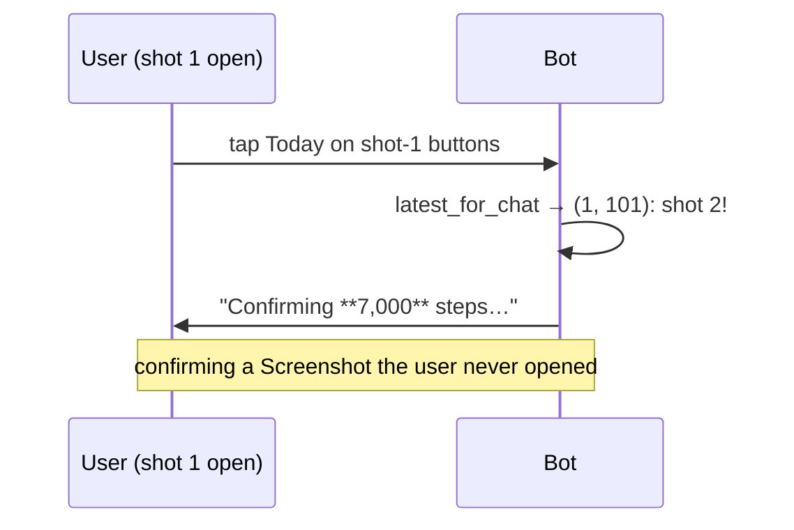
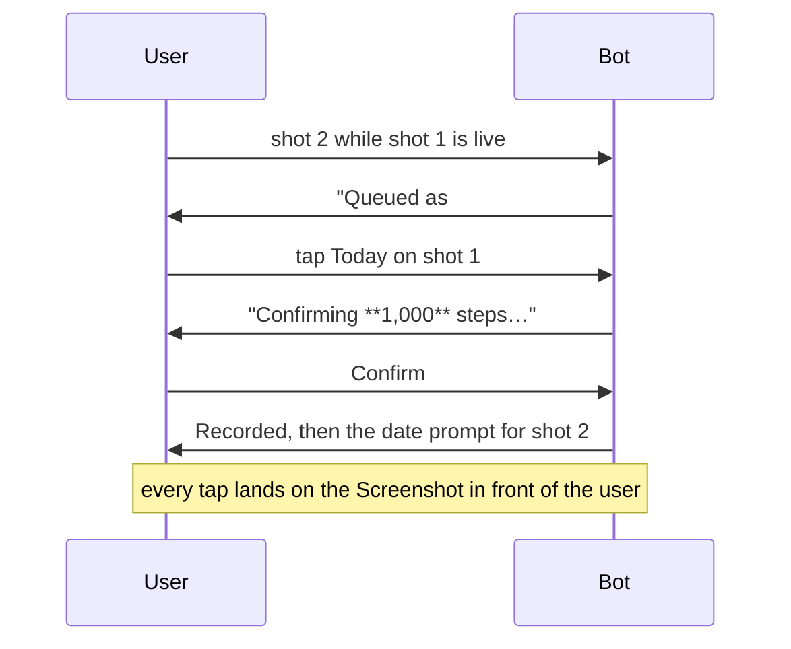

# Confirmation queue: before vs after

Rapid uploads confused the bot: both keyboards retargeted the newest
Screenshot, so Confirm could commit a different Screenshot than the one
shown. The queue gives one chat at most one live confirmation; later
arrivals wait in FIFO and are presented as each active resolves.

## Before (max-wins fallback)

## After (FIFO + advance)

## Why this shape

- **Read at intake, confirm in turn**: the browser work is unchanged;
  only the staging order changed, so RAM behavior is identical.
- **Queued items carry no buttons**: a tap cannot address them, which is
  what makes the wrong-Screenshot outcome structurally impossible rather
  than merely unlikely.
- **Advance on every resolve** (commit, cancel, failure, expiry): the line
  moves however the head leaves, so nothing wedges and nothing starves
  short of TTL or restart (both accepted, both documented in
  `telegram/pending.py`).
