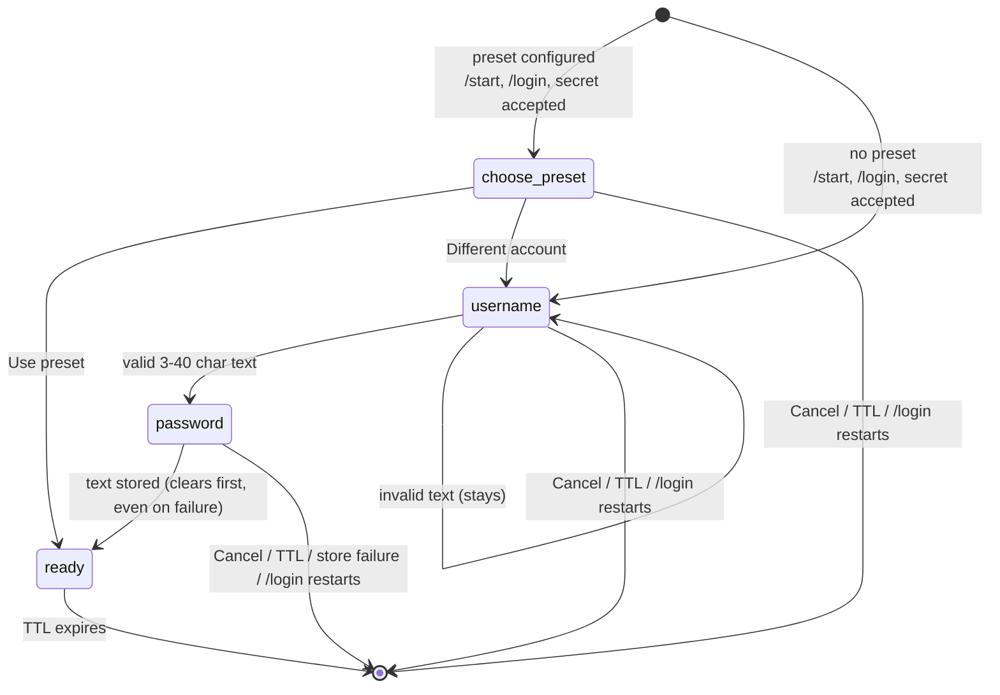

# Credentials Prompt — states and transitions

One chat's position in the prompt is one row in `PROMPTING`
(`prompts.py`), shaped `{stage, at, username?, preset?}`. `stage` is one
of four values; `at` is the last-transition timestamp driving the 600s
TTL, which applies to every stage including `ready`. There is no
background sweeper: `prompt_stage()` pops expired rows on read.

## States

| State | Keys | Meaning |
|---|---|---|
| *(none)* | — | No prompt in progress. Unknown text gets `no_prompt()`. |
| `choose_preset` | stage, at | Preset credentials exist; the chat picks preset or typed. |
| `username` | stage, at | Waiting for the Site username. |
| `password` | stage, at, username, preset | Waiting for the password; carries the username forward because `set_stage` replaces the whole row rather than merging. |
| `ready` | stage, at, username, preset | Credentials resolved. Terminal: `kb_for()` falls through to the standing keyboard. Still TTL'd — after 600s of silence the row pops and the next message starts over. |

## Transition rules

- **Entry** always goes through `start_credential_stage()` (preset ? `choose_preset` : `username`) or `ask_username()` directly. `/login` clears first, so it restarts from anywhere.
- **Empty text** in `username`/`password` is ignored, not an answer — the stage does not advance.
- **Store failure still clears**: the password branch clears the stage in a `finally`, so a failed save cannot wedge the prompt. The user re-runs `/login`; there is no in-place retry.
- **Cancel** clears from any stage and replies `cancelled()` with the standing keyboard.
- **Preset path never touches the vault**: `ready` with `preset=True` resolves to `config.SITE_USERNAME/PASSWORD` at use time; nothing is stored.
- **Logout** clears without starting a new stage.
- **Mid-prompt Submit** is intercepted before prompt handling (`cancel_prompt_first`), so a tapped button is never stored as a username.

## Related, not this machine

The Confirmation flow (pending screenshot → date → overwrite check → Commit)
has its own progression in `telegram/pending.py` (`date` → `iso`/`label` →
`prev` → recorded), but those are record fields accumulating toward one
action, not states with transitions — there is exactly one terminal action
and no branching. Deliberately undocumented here to keep this file about
the one real state machine.
